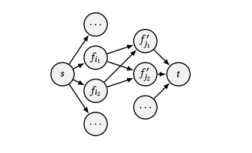

# Needle: Detecting Code Plagiarism on Student Submissions
###Yanyan Jiang  
- jyy@nju.edu.cn 
- State Key Laboratory for Novel Software Technology, Nanjing University

### Chang Xu 
- changxu@nju.edu.cn 
- State Key Laboratory for Novel Software Technology, Nanjing University

## ABSTRACT

代码抄袭是编程实践中最常见的学术不诚实活动之一。 自动代码抄袭检测在防止剽窃和保持学术诚信方面发挥着重要作用。 本文介绍了一种新颖的代码抄袭检测算法，它基于程序间编辑距离的网络流量近似。 本文还介绍了算法的有效性和效率评估，从实践中应用针的经验教训和经验，以及对未来挑战的讨论。

## 1.INTRODUCTION

代码抄袭是编程实践中最普遍的学术不诚实活动之一[15]，如果没有适当的机制来预防[1]，可能会出乎意料地严重。

代码剽窃检测工具可帮助教师识别学生提交的潜在的程序抄袭。这些工具的开发可以追溯到20世纪80年代早期[7]，并且经历了积极的研究。 这样的工具使用token序列[11,14]或依赖图特征[2,6,9]计算一对程序之间的相似性。

另一方面，现有的代码抄袭检测技术可以被“聪明”的学生通过应用某些语义变化来欺骗，这些语义保留了语法和依赖关系图的特点[3，12]。 有效和高效地识别这种代码抄袭是一项挑战。 背景和相关工作在第2节中作了简要介绍。

本文介绍了我们的代码抄袭检测技术解决方案，以及我们在教学实践中应用代码抄袭检测工具的实地研究。

本文的主要技术贡献是用于检测程序二进制文件中的代码抄袭的新算法利器（及其实现），使得它可以容易地应用于用C / C ++，Java或Go编写的程序。 该算法在多项式时间内近似程序之间的编辑距离（程序二进制可以“嵌入”到另一程序中的程度）。 该算法不仅可以抵抗简单的程序更改（变量重命名或本地程序语义更改），而且还可以抵抗许多类型的语义 - 保留更改，从而彻底改变语法和依赖图功能，如函数合并和拆分。 3.1-3.3节详细说明了这种算法。

我们评估了该算法（在3.4节）并在课程教学实践中部署了该工具。 我们进行了实证研究并报告了我们的经验：（1）匿名编程任务的案例研究，没有抄袭预防（第4.1节），以及（2）针对“编译器原理和技术”中三年的现场部署 当然（见4.2节）。 以下重点介绍了这些发现，并在第5节进一步讨论。

我们三年的实地研究经验表明，部署代码抄袭检测工具可以大大缓解这个问题，但代码抄袭不容易消除。 仍然有大约20％的学生冒着剽窃的风险，许多学生改变了程序来欺骗抄袭检测工具。

与课程设计相关的的学术诚信维护在我们的课程体系中几乎是空白。 我们希望本文中提出的结果可以作为一个警钟，以进一步关注这个问题。

## 2 BACKGROUND

### 2.1 Code Plagiarism of Students

抄袭是学术课程中常见的问题，学生可以利用他人的工作获得更高的成绩。 学生可以复制他人的代码（并经常对其进行语义保留更改或混淆）并获得不诚实的成绩，从而威胁到学术系统的完整性。 在课堂上[11,13,15]认识并惩罚这种行为至关重要：不仅要保持学术诚信，还要减少同一课程后续编程任务中的剽窃行为。

学生通常会选择抄袭，因为他们要么缺乏完成任务的能力，要么缺乏时间。 根据Wager [15]的结果，通常通过执行以下类型的更改或混淆来获取抄袭副本：

- T1 更改注释，名称或实例。
- T2 重新格式化或重新排序代码片段。
- T3 添加或删除冗余元素。
- T4 重构标准结构，例如循环类型和函数结构。

```cpp
// Two semantically equivalent but syntactically different functions.
int f(int *a, int n) {
int s = 0;
for (int i = 0; i < n; s += a[i++]);
return s;
}
int g(int *a, int n) {
int i = 0, sum = 0;
while (i < n) { sum = sum + *(a + i); i++; }
return sum;
}
```

对于超出以上4条的代码变化（例如，独立地重新实现功能组件），甚至对于人来说也不可能达成剽窃的判决。 此外，在实践中认识到这种抄袭的频率要低得多，我们认为这种改变超出了本文的范围。

学生可以同时应用多种类型的改变，并且可以对程序的特定部分应用进一步的改变（例如，通过添加一些不相关的功能）。 所有这些因素都增加了在实践中检测代码剽窃的挑战。

### 2.2 Related Work
剽窃的代码可自动检测。 这样的想法可以追溯到20世纪80年代早期[7]。 典型的抄袭检测工具使用token序列[14]等语法特征或程序依赖图（例如，控制或数据依赖）的指纹识别[2,6,9]来概述程序，并通过计算测量一对程序之间的概述距离，来判断程序的相似性。

例如，moss[14]将程序总结为其n-gram token分布；gplag[9]通过其依赖关系图总结程序。程序之间的相似性被认为是子图同构问题，通过启发式搜索解决，现有的代码克隆检测技术[2，6]也可以应用于代码剽窃检测。对这些工具进行了研究[8]和改进[4、5、11]。

## 3 AUTOMATED CODE PLAGIARISM DETECTION
### 3.1 Observations and Insights
为了自动识别可能会发生变化的抄袭副本，我们利用以下观察结果： 

（1）编译器优化很好地规范了功能上等同但语法上不同的代码片段[10]。 这是因为编译器优化器总是在保留程序语义的同时搜索“最佳”指令序列，并且适应当地小语义变化的本质。
（2）抄袭出的副本P虽然可能受到了混淆，甚至附加功能，但通常适当地“包含”被抄袭的版本，否则将需要大量的代码重构或功能模块的重新实现。 换句话说，通常存在将被抄袭的程序的二进制中的指令嵌入到P的二进制指令中。

因此，我们认为代码抄袭检测可以通过测量两个程序二进制文件之间的“嵌入”程度作为离散优化问题来完成，这将在下面详细说明。

### 3.2 Problem Formulation
#### 3.2.1
准备工作。我们从一组程序二进制文件$\varphi$（学生提交的文件）中检测到潜在的抄袭代码克隆。 每个程序$P \in \varphi$ 是函数列表$P = \{f_1，f_2，..., ,f_n\}$。 函数$f_i \in P（i \in [n]）$是一系列机器指令。 我们使用$|f_i|$ 表示$f_i$的指令序列长度，并使用$f_{i,j}$表示$f_i$中的第$j$个指令$（1≤j≤| fi |）$

给定程序$P_1 = \{f_1，f_2，..., ,f_n\}$ 和$P_2 = \{f'_1，f'_2，..., ,f'_n\}$，我们想量化$P_1$可以“嵌入”到$P_2$的程度。 简单的来说，$P1$可以嵌入到$P2$中，或者更可能的情况是$P_1$是$P_2$的修改版本（因此易于成为$P_2$的抄袭）。我们首先定义程序之间的编辑距离，然后放宽这种易处理算法的定义。

#### 3.2.2
程序之间的编辑距离。 编辑距离（P1，P2）被定义为将P1转换为目标程序的最小成本，当作为指令序列写入时，该程序与P2的相同。 允许以下编辑操作：

（1）以零成本重新排序两个函数。

（2）删除指令$f_{i，j}$，花费$c_d$

（3）修改指令$f_{i，j}$（指令类型或操作数），成本为$c_m$。

（4）在函数$f_i$的位置$j$插入任意指令，花费$c_i$


设置$c_d = c_m = 1$（删除和修改具有单位成本）并且$c_i = 0$（插入填充指令的成本为零）反映了测量P1可以嵌入P2的程度的想法，并且在实践中work well。

假设$P_1$是$P_2$的抄袭副本。 如果$P_1 = P_2$，则$d(P_1,P_2)= 0$是微不足道的。更改注释，名称，大小写和变量/函数的顺序不会影响$d(P_1,P_2)$，从而在二进制上定义编辑距离本质上对T1-T2类型的变化具有弹性。

对于T3-T4类型的更改，它们可能会对二进制文件产生轻微影响，而$d(P_1,P_2)$则反映了已完成的更改量。 下面显示了一个真实的抄袭代码片段（由我们的工具检测），其中手动扩展了一个功能组件。 设置$c_i = 0$会在$P_1$和$P_2$之间产生一个小的编辑距离。

```cpp
void P1() {
	...
	puts("Game␣Over");
	...
}
void P2() {
	...
	puts("G"); puts("a"); puts("m");
	puts("e"); puts("␣"); puts("O");
	puts("v"); puts("e"); puts("r");
	...
}
```


由$P_1$和$P_2$构成的流程图$G$. 每个边$(u,v)$具有容量$c(u,v)$和权重$w(u,v)$。 从源顶点$s$到汇点顶点$t$的最大流表示$P_1$可以嵌入$P_2$的程度。

### 3.3 The needle Algorithm
虽然编辑距离在检测代码抄袭方面是有效的，但计算$d(P_1,P_2)$是NP完全问题。 对于大约104条指令的中型程序，计算成本是无法承受的。 针算法是可以在多项式时间内计算的编辑距离的近似值。

为了近似$d(P_1,P_2)$，我们首先定义一对函数$f_i\in P_1$和$f'_j\in P_2$之间的相似性

$$\sigma (f_i,f'_j) = \max_{k \in \{1,2,...,|f'_j|\}} LCS(f_i,f'_j[k:k + \omega])$$

其中$LCS(s_1,s_2)$表示$s_1$和$s_2$的最长公共子序列（如果它们的操作码相同，则指令等于另一个），$f'_j [k:k+\omega]$表示其索引所在的$f'_j$的子序列,范围$[k,min \{k+\omega,|f'_j|\}]$。 直观地，$\sigma(f_i,f'_j)$是在固定窗口大小$\omega$中受约束的最长公共子序列。
较大的$\sigma$表示$f_i$中的更多指令在$f'_j$中的长度为$\omega$的连续指令序列中具有对应的等效指令，因此表示较小的距离$d$。

然后，我们通过计算所有函数$f_i \in P_1$可以嵌入到$P_2$中的函数的程度来计算$P_1$和$P_2$之间的相似性。 为了将$P_1$中的多个函数嵌入到单个函数$f'_j\in P_2$中，我们构造了一个加权流网络图$G =(V,E)$，其容量函数为$c:E \mapsto \mathbb{R}$和权重函数$w:E \mapsto \mathbb{R}$. 设 $V = \{s,t,l_1,...,l_n，r_1 ,... ,r_m\}$ 其中$s$是源点，$t$是汇点，如图所示。




对于每个$i\in[n]$，构造一个边$(s,l_i)$，其中$c(s,l_i)=|f_i|$和$w(s,l_i)=0$; 对于每个$j\in[m]$，构造一个边$(r_j,t)$，其中$c(r_j,t)=|f'_j|$ 和$w(r_j,t)=0$; 对于每个$(i,j)\in [n]×[m]$，构造一个边$(li,rj)$，其中

$$c(l_i,r_i)=\sigma(f_i,f'_j)$$
$$w(l_i,r_j)=\frac{1}{1 + e^{-\alpha \cdot \frac{max\{\sigma(f_i,f'_j),\sigma(f'_j,f_i)\}}{min\{|f_i|,|f'_j|\}}+\beta}}$$

具有常数$\alpha$和$\beta$的逻辑函数用于归一化权重，使得一对函数之间的“成功”嵌入将具有接近1的权重，而失败的嵌入将具有接近0的权重。

因此，$P_1$和$P_2$之间的相似性定义为:
$$\sigma(P_1,P_2)=\frac{MaximunWeightFlow(G,c,w)}{\sum_{i \in [n]}|f_i|}$$

因此，$P_1$和$P_2$之间的相似性被定义为最佳全局指令嵌入值(由最大权重网络流量表示)除以$P_1$中的指令数量。 直观地，$(l_i,r_j)\subseteq E$中的每个流动单元将$f_i \in P_1$中的指令嵌入到$f'_j \in P_2$中的另一个指令中。 只有那些有大权重$w(l_i,r_j)$的边，表明$f_i$可以嵌入到$f'_j$中，对最终相似性得分有突出贡献，而较大的$\sigma(P_1,P_2)$表示较小的$d(P_1,P_2)$


该算法被实现为命令行工具bincmp，其中$\omega= \frac{3}{2}|f_i|,\alpha = 2$，并且$\beta = \frac{1}{2}$。 为了检测一组程序中的代码剽窃，驱动程序将一组程序二进制路径作为参数，调用objdump来提取指令序列，去除系统和公共库，最后管理并行bincmp比较的队列。 实际上，调用bincmp通常需要花费几秒钟的时间。 分析数百个提交（通过成对比较）在多处理器计算机上花费不到一个小时的时间。

### 3.4
#### 3.4.1实验设置。
评估尝试回答以下两个问题：
（1）（有效性）可以有效地检测编程任务中的代码剽窃吗？
（2）（效率）针在抄袭检测中是否花费了合理的资源？

评估是在“编译器设计和实施”课程的实验室中对一组学生的37份提交作出的。 在实验室中，学生需要使用flex和bison解析C--（C编程语言的简化方言）程序并生成语法树。 这种代码抄袭检测任务特别具有挑战性，因为学生的代码与flex和bison自动生成的代码混合在一起，这可能对剽窃检测的精确度产生负面影响。

为了评估有效性，我们手动检查了这些程序（借助于程序相似性得分），并对那些可疑的抄袭学生进行面对面访谈。为了评估效率，记录并分析运行时间信息。

我们还实现了一种快速，可扩展的代码克隆检测算法，该算法基于控制流图[2]（命名为Centroid）的指纹进行比较。 函数的指纹（质心）仅在一组程序修改中稍微改变，因此抄袭$P_1$和$P_2$倾向于具有许多函数对$f_i\in P_1$和$f'_j\in P_2$具有相似的质心。

3.4.2结果。 由针和中心产生的相似性得分如图4所示。每条曲线以降序绘制程序对的相似性得分。 总体相似性得分很高，因为学生的代码与flex和bison生成的代码混合在一起。 典型学生的作品由约500行代码组成，而相应的生成代码约为5,000行。 很明显，与质心相比，针头产生更平滑的分数分布。


